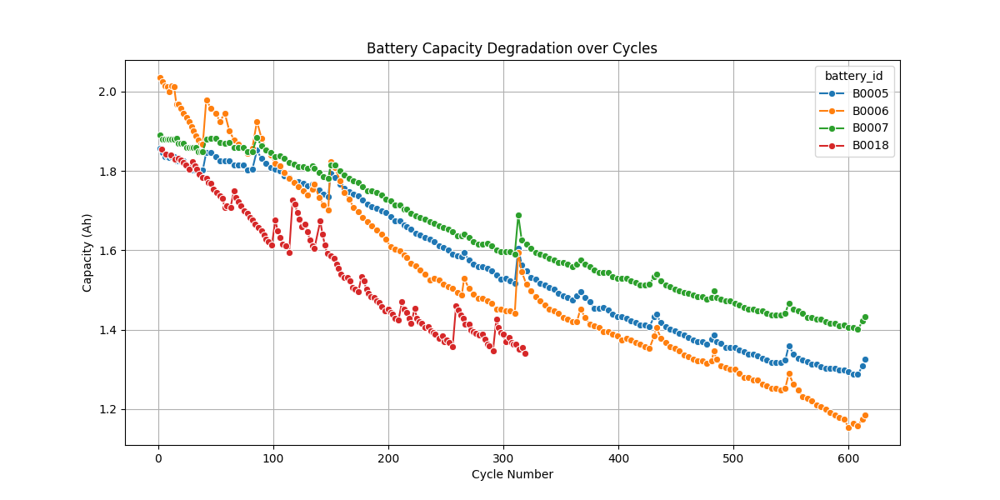
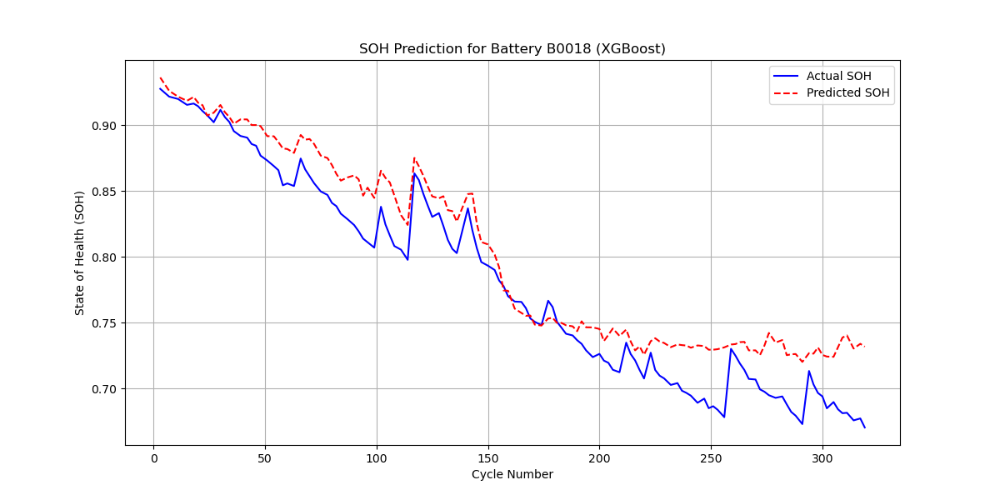

# Battery State of Health (SOH) Estimation

This project implements a machine learning pipeline to estimate the State of Health (SOH) of Li-ion batteries using the **NASA Prognostics Center of Excellence (PCoE) Battery Dataset**. It compares two approaches:
1.  **XGBoost**: A gradient boosting model using extracted scalar features (Voltage, Temperature, Time).
2.  **LSTM (Long Short-Term Memory)**: A deep learning model using raw charge/discharge curves.

## 📊 Results Overview

| Model | RMSE | R² Score |
|-------|------|----------|
| **XGBoost** | **0.0835** | **0.7073** |
| LSTM | 0.1041 | 0.5448 |

*Note: XGBoost currently outperforms LSTM on this small dataset (~600 cycles). LSTM requires more data to generalize effectively.*

## 📂 Project Structure

```
Battery State of health(SOH) Estimation/prediction/
├── data/                   # Raw and processed data
│   ├── battery_data_set.zip
│   ├── processed_summary.csv
│   └── *.mat               # Extracted MATLAB files
├── notebooks/              # Generated plots
├── src/
│   ├── data_loader.py      # Downloads and processes NASA dataset
│   ├── eda.py              # Exploratory Data Analysis
│   ├── train_xgboost.py    # XGBoost training script
│   ├── train_lstm.py       # LSTM training script
│   └── compare_models.py   # Comparison script
└── requirements.txt        # Dependencies
```

## 🚀 Getting Started

### 1. Installation
```bash
pip install -r requirements.txt
```

### 2. Data Preparation
Download and process the NASA dataset:
```bash
python src/data_loader.py
```
*This will download `battery_data_set.zip` (~200MB) and extract features to `data/processed_summary.csv`.*

### 3. Run Analysis
**Exploratory Data Analysis (EDA):**
```bash
python src/eda.py
```
Generates capacity degradation plots in `notebooks/`.

**Train XGBoost:**
```bash
python src/train_xgboost.py
```
Trains the model and saves prediction plots.

**Train LSTM:**
```bash
python src/train_lstm.py
```
Trains the deep learning model on raw curves.

**Compare Models:**
```bash
python src/compare_models.py
```
Runs both models on a test battery and plots the comparison.

## 📈 Visualizations

### Capacity Degradation
Battery capacity fades over time (cycles). SOH is defined as $C_{current} / C_{nominal}$.


### XGBoost Prediction (Test Battery: B0018)
XGBoost captures the overall degradation trend well using features like `avg_voltage` and `discharge_time`.


### Model Comparison (Test Battery: B0005)
Comparison of Actual SOH vs XGBoost and LSTM predictions.
*(Run `src/compare_models.py` to generate this plot)*
<!--  -->

## 🛠️ Methodology

### Data
- **Source**: NASA PCoE Battery Dataset (B0005, B0006, B0007, B0018).
- **Type**: Li-ion 18650 cells run through charge/discharge aging cycles.
- **Target**: Capacity (Ah) -> Converted to SOH.

### Feature Engineering
- **Scalar Features (for XGBoost)**:
    - Average Discharge Voltage
    - Minimum Discharge Voltage
    - Maximum Temperature
    - Discharge Time
    - Ambient Temperature
- **Time-Series Features (for LSTM)**:
    - Raw Voltage, Current, and Temperature curves resampled to 200 time steps.

### Future Improvements
- **Hybrid Models**: Combine CNN for feature extraction with LSTM.
- **Data Augmentation**: Use GANs or add noise to raw curves to increase dataset size for Deep Learning.
- **Hyperparameter Tuning**: Optimize LSTM architecture.
